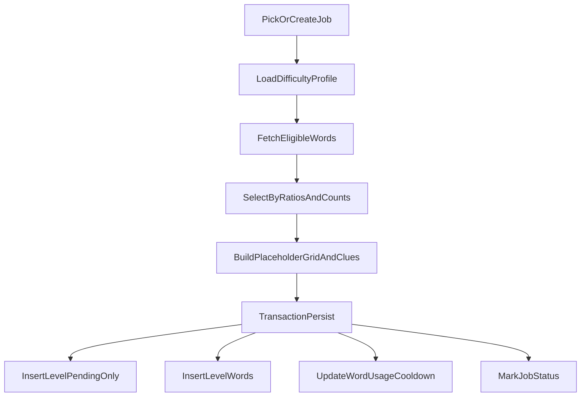

# Phase-0 First-Run Setup Plan

## Impact Assessment

- Backend: Yes — new tables, enum changes, level extensions, RLS, seed data, generator skeleton, CLI script.
- Contracts: Yes — update `CONTRACTS/db.schema.sql` (+ contract metadata) to reflect new DB surface; verify `CONTRACTS/level.schema.json` compatibility remains intact.
- Frontend: No direct feature work in Phase-0 (existing clients continue reading approved levels only).
- Monetization/Performance/Release: No.

## Key Files To Change

- [backend/supabase/migrations](backend/supabase/migrations) (new `004_phase0_generation_setup.sql`)
- [backend/supabase/migrations/002_rls_policies.sql](backend/supabase/migrations/002_rls_policies.sql) (or new additive migration statements for policy changes)
- [backend/supabase/functions/_shared/types.ts](backend/supabase/functions/_shared/types.ts) (`Difficulty` -> include `expert`)
- [backend/supabase/functions/getLevel/index.ts](backend/supabase/functions/getLevel/index.ts) (ensure approved-only behavior is enforced at query level for mobile reads)
- New generator module under [backend/supabase/functions/_shared](backend/supabase/functions/_shared) or sibling `backend/supabase/functions/generator/` (runner + helpers)
- [package.json](package.json) (add `generate:one` dev script)
- [CONTRACTS/db.schema.sql](CONTRACTS/db.schema.sql) (contract-first sync)
- [CONTRACTS/status.backend.md](CONTRACTS/status.backend.md) (milestone/status update)

## Execution Sequence

### Step 1 — Backend-Core-Agent: Contract-First DB Surface Update

- Update `CONTRACTS/db.schema.sql` to include:
  - new tables: `words`, `word_usage`, `level_words`, `difficulty_profiles`, `generation_jobs`
  - `levels` additions: `review_status`, `review_notes`, `reviewed_by`, `reviewed_at`, `generator_version`, `language`, `target_difficulty`, `computed_difficulty_score`, `grid_size`, `word_count`, `words_breakdown`, `quality_score`, `solution_hash`, `auto_generated`
  - enum expansion to include `expert` where applicable.
- Bump contract version/changelog entries.
- Update `CONTRACTS/status.backend.md` with Phase-0 milestone entry.
- Depends on: none.
- Produces: contract-aligned schema spec for implementation.

### Step 2 — Backend-Core-Agent: Migration + RLS + Seed Implementation

- Create migration `004_phase0_generation_setup.sql` with:
  - tables/constraints/indexes exactly requested:
    - `words`: unique `(language, word)`
    - `word_usage`: PK `(word_id)`
    - `level_words`: unique `(level_id, word_id)`
    - `generation_jobs`: status indexes
    - `levels`: index `(review_status, language, target_difficulty)`
  - `levels.review_status` enum (`pending|approved|rejected`) and all requested review/generation metadata columns.
  - extend difficulty enum to include `expert`.
  - RLS policy updates:
    - mobile/regular reads: approved-only
    - admin reads/updates for pending/rejected via JWT `app_metadata.role = 'admin'`
    - rejected transitions require non-empty `review_notes` (enforced via `WITH CHECK`/trigger-style guard)
  - seed default `difficulty_profiles` rows for `easy/medium/hard/expert` with sensible ratios, grid bounds, word count ranges, cooldown days, quality thresholds.
- Ensure generator constraints are DB-enforced where practical (e.g., defaults/checks that keep `review_status='pending'` for inserts unless explicit admin transition).
- Depends on: Step 1.
- Produces: runnable migration and seeded profile defaults.

### Step 3 — Backend-Core-Agent: Generator Skeleton (Phase-0 Only)

- Implement a one-shot runner that:
  - picks existing queued job or creates next job tuple (`language`,`target_difficulty`)
  - fetches `difficulty_profiles`
  - selects candidate words by language, lock/cooldown eligibility, and target ratio buckets
  - builds placeholder `grid_json` / `clues_json` that satisfy `CONTRACTS/level.schema.json` shape
  - computes `computed_difficulty_score`, `word_count`, `words_breakdown`, `quality_score`, `solution_hash`
  - persists in a single transaction:
    - insert `levels` with `review_status='pending'` and `auto_generated=true`
    - insert `level_words`
    - upsert/increment `word_usage` (`used_count`, `last_used_at`, `cooldown_until`)
    - mark job status success/failure with attempts + last_error
- Hard guarantees to enforce in code:
  - generator ALWAYS inserts `pending`
  - generator NEVER approves/rejects
  - transaction wraps persist step
- Depends on: Step 2.
- Produces: executable Phase-0 generator module.

### Step 4 — Backend-Core-Agent: Local CLI Script

- Add root script `generate:one` in `package.json` (local/dev one-shot).
- Command target should run generator once against local Supabase environment.
- Also document exact commands in project docs output.
- Depends on: Step 3.
- Produces: reproducible local generation command.

### Step 5 — Contract-Guardian: Cross-Boundary Validation

- Validate migrations/functions/contracts are synchronized after Steps 1–4.
- Confirm `level.schema.json` compatibility with placeholder `grid_json`/`clues_json` shape.
- Flag any API/contract drift.
- Depends on: Step 4.
- Produces: PASS/FAIL sync report.

### Step 6 — Orchestrator Finalization

- Return exact run commands:
  - migration apply command(s)
  - `generate:one` command
- Stop explicitly after Phase-0.
- Include a Phase-1 checklist (real CSP/backtracking grid fill engine).

## Proposed Default Seed Values (Phase-0)

- easy: ratios `{easy:0.70, medium:0.25, hard:0.05, expert:0.00}`, grid `8..10`, words `8..12`, cooldown `30`, quality threshold `60`
- medium: `{easy:0.40, medium:0.45, hard:0.15, expert:0.00}`, grid `9..12`, words `10..15`, cooldown `30`, quality threshold `70`
- hard: `{easy:0.15, medium:0.45, hard:0.30, expert:0.10}`, grid `10..14`, words `12..18`, cooldown `30`, quality threshold `78`
- expert: `{easy:0.05, medium:0.25, hard:0.45, expert:0.25}`, grid `11..15`, words `14..22`, cooldown `21`, quality threshold `85`

## Data Flow (Phase-0)

## Risks / Notes

- Existing `levels.difficulty` enum expansion to `expert` is additive but should be checked against any strict frontend typings.
- RLS admin detection depends on JWT app metadata (`app_metadata.role='admin'`); local auth tokens used for admin tooling must include this claim.
- `getLevel` currently uses service client; approved-only visibility must be enforced in query logic to avoid bypass via function internals.

## Phase-1 Checklist (Do Not Implement Yet)

- Real grid fill engine (CSP/backtracking + MRV + fail-fast)
- Dynamic grid growth retries (`grid_min -> grid_max`)
- Fallback strategies when pool too small (controlled cooldown relaxation)
- Better clue sourcing pipeline (definition -> wiktionary -> LLM)
- Validation/scoring enhancements (crossing density, duplicate detection, quality metrics)
- Repair workflow for rejected levels (manual reprocess command)

